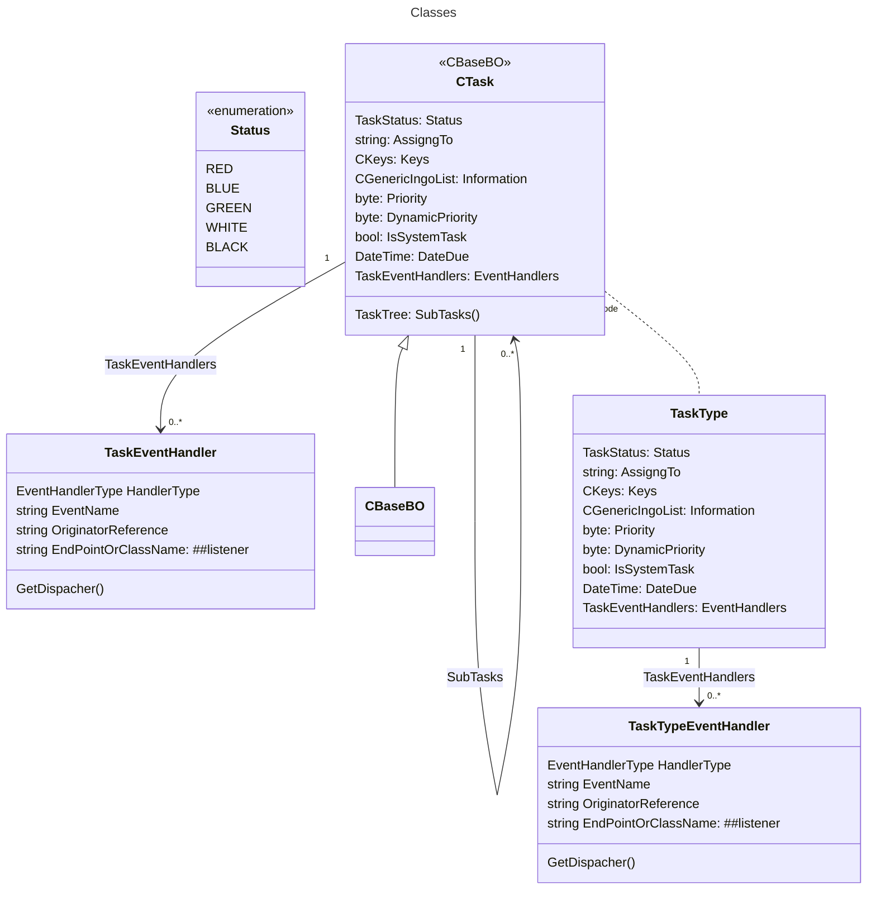

# Test-for-Test-Project
Nothing of any use whatsoever

```mermaid
---
title: Classes
---
classDiagram


class Status{
    <<enumeration>>
    RED
    BLUE
    GREEN
    WHITE
    BLACK
}


class CTask {
	<<CBaseBO>>
	TaskStatus: Status
    string: 	AssigngTo
    CKeys:      Keys
    CGenericIngoList: Information
    byte: Priority
    byte: DynamicPriority
    bool: IsSystemTask
    DateTime: DateDue
    
    TaskEventHandlers: EventHandlers
    TaskTree: SubTasks()
}
	
class TaskEventHandler {
	EventHandlerType HandlerType
	string EventName
	string OriginatorReference
	string EndPointOrClassName: ##listener
	GetDispacher()
}
	
	
	CTask <|-- CBaseBO
	CTask "1" --> "0..*" CTask: SubTasks
	CTask "1" --> "0..*" TaskEventHandler: TaskEventHandlers
		
	
	
	
	
class TaskType {
	TaskStatus: Status
    string: 	AssigngTo
    CKeys:      Keys
    CGenericIngoList: Information
    byte: Priority
    byte: DynamicPriority
    bool: IsSystemTask
    DateTime: DateDue
    
    TaskEventHandlers: EventHandlers
 }
	
class TaskTypeEventHandler {
	EventHandlerType HandlerType
	string EventName
	string OriginatorReference
	string EndPointOrClassName: ##listener
	GetDispacher()
}
	
	
	TaskType "1" --> "0..*" TaskTypeEventHandler: TaskEventHandlers
	CTask "code" .. TaskType 
		
	
```

